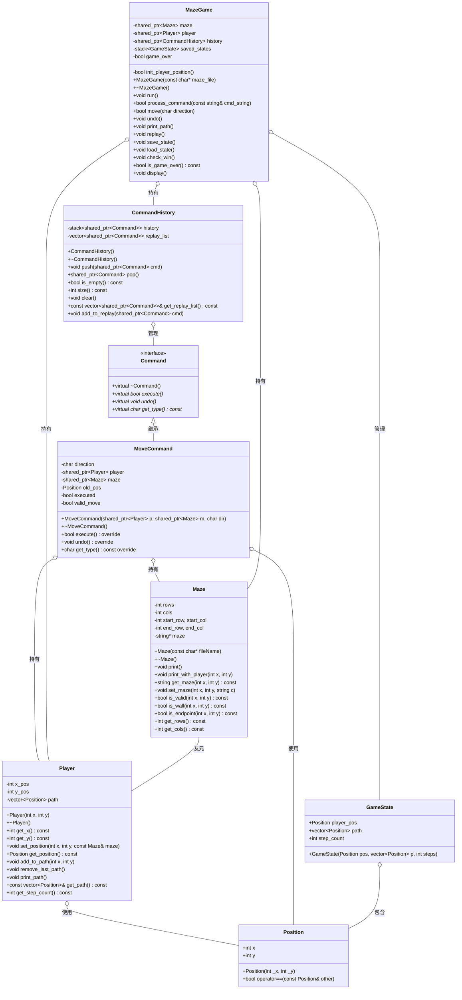
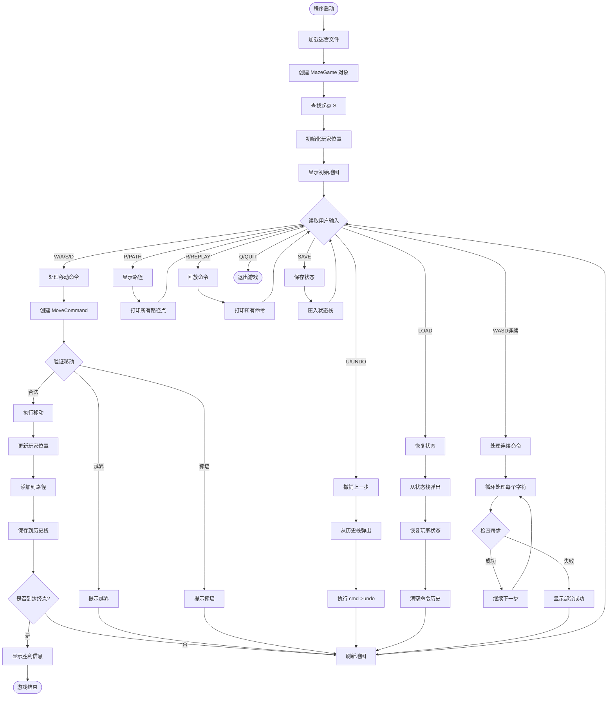

# 迷宫游戏项目 (Project 1) - 完整技术文档

## 📋 项目概述

### 项目信息
- **项目名称**: 迷宫游戏 (Maze Game)
- **开发语言**: C++11
- **编译器**: g++ (MinGW)
- **代码行数**: 
  - `maze.h`: 174 行
  - `maze.cpp`: 820 行
  - **总计**: ~1000 行
- **可执行文件**: `bin/maze_new.exe` (840 KB)

### 功能特性
✅ 从文件加载迷宫（支持 UTF-8 编码）  
✅ 玩家移动控制（W/A/S/D）  
✅ 命令模式实现（支持撤销/重做）  
✅ 路径记录与回放  
✅ 游戏状态保存/恢复  
✅ 实时地图显示（包含玩家位置标记）  
✅ 连续命令支持（如 "WASD" 连续移动）  
✅ 智能错误处理与边界检查  

---

## 🏗️ 系统架构

### 核心设计模式
1. **命令模式 (Command Pattern)** - 实现可撤销的操作
2. **智能指针管理** - 使用 `std::shared_ptr` 管理内存
3. **友元类设计** - Maze 与 Player 的紧密协作

### 关键数据结构
1. **std::vector** - 存储玩家路径 (Player::path)
2. **std::stack** - 命令历史栈 (CommandHistory::history)
3. **std::stack** - 游戏状态栈 (MazeGame::saved_states)
4. **std::string** - UTF-8 编码字符串存储迷宫

---

## 📐 UML 类图



---

## 📚 类详细说明

### 1. Maze 类 - 迷宫核心

#### 职责
- 从文件加载迷宫数据
- 管理迷宫地图（支持 UTF-8 编码）
- 提供边界检查、墙壁检测、终点判断

#### 关键成员

```cpp
private:
    int rows, cols;                  // 迷宫尺寸
    int start_row, start_col;        // 起点坐标
    int end_row, end_col;            // 终点坐标
    std::string *maze;               // 迷宫数据（字符串数组）
```

#### 核心方法

**构造函数**: `Maze(const char *filename)`
```cpp
// 1. 读取第一行获取行列数和起终点坐标
// 2. 使用 std::getline 读取每一行（支持UTF-8）
// 3. 自动扫描迷宫寻找 'S' 和 'E' 确保坐标准确
```

**get_maze(int x, int y)**: 获取指定位置的字符（UTF-8 安全）
```cpp
// 核心算法：
// 1. 遍历字符串，使用 getUTF8CharLength() 判断每个字符的字节长度
// 2. 计数视觉字符（不是字节）到达第 y 个字符
// 3. 提取完整的 UTF-8 字符（可能是 1-4 字节）
```

**技术亮点**: UTF-8 字符处理
```cpp
int getUTF8CharLength(unsigned char c){
    if((c & 0x80) == 0) return 1;        // ASCII: 0xxxxxxx
    if((c & 0xE0) == 0xC0) return 2;     // 两字节: 110xxxxx
    if((c & 0xF0) == 0xE0) return 3;     // 三字节: 1110xxxx (如中文 '·')
    if((c & 0xF8) == 0xF0) return 4;     // 四字节: 11110xxx
    return 1;
}
```

#### 文件格式
```
15 15 1 1 14 14          # rows cols start_x start_y end_x end_y
# # # # # # # # # # # # # # # 
# S · · · · # · · · · · · · # 
# · # · # · # · # # # # # · # 
...
# · # # # # # · # # # · # E # 
# # # # # # # # # # # # # # # 
```

---

### 2. Position 结构 - 位置坐标

#### 职责
- 封装二维坐标 (x, y)
- 提供相等性比较

```cpp
struct Position {
    int x, y;
    Position(int _x = 0, int _y = 0) : x(_x), y(_y) {}
    bool operator==(const Position& other) const {
        return x == other.x && y == other.y;
    }
};
```

**使用场景**:
- Player::path 中记录移动路径
- GameState 中保存玩家位置
- MoveCommand 中保存旧位置

---

### 3. Player 类 - 玩家管理

#### 职责
- 管理玩家当前位置
- 记录移动路径（vector 数据结构）
- 提供路径操作（添加、删除、打印）

#### 关键成员

```cpp
private:
    int x_pos, y_pos;                    // 当前位置
    std::vector<Position> path;          // 移动路径（数据结构1）
```

#### 核心方法

**set_position(int x, int y, const Maze& maze)**
```cpp
// 注意：参数是 const Maze& 引用，避免拷贝和浅拷贝问题
void Player::set_position(int x, int y, const Maze& maze){
    if(maze.is_valid(x, y) && !maze.is_wall(x, y)){
        this->x_pos = x;
        this->y_pos = y;
    }
}
```

**add_to_path(int x, int y)**
```cpp
// 使用 vector::push_back 添加到路径末尾
void Player::add_to_path(int x, int y){
    this->path.push_back(Position{x, y});
}
```

**remove_last_path()**
```cpp
// 使用 vector::pop_back 删除最后一个元素（撤销时使用）
void Player::remove_last_path(){
    if(!this->path.empty()){
        this->path.pop_back();
    }
}
```

**print_path()**
```cpp
// 每行打印4个坐标，格式化输出
void Player::print_path(){
    for(auto it = this->path.begin(); it != this->path.end(); ++it){
        std::cout << "x: " << it->x << " y: " << it->y << "    ";
        if((it - this->path.begin()) % 4 == 0 && it != this->path.begin()){
            std::cout << std::endl;
        }
    }
}
```

---

### 4. Command 类 - 命令模式基类

#### 职责
- 定义命令接口（抽象基类）
- 强制子类实现 `execute()`、`undo()`、`get_type()`

```cpp
class Command{
public:
    virtual ~Command() = default;
    virtual bool execute() = 0;      // 执行命令，返回是否成功
    virtual void undo() = 0;         // 撤销命令
    virtual char get_type() const = 0;  // 获取命令类型
};
```

**设计模式**: 经典的命令模式（Command Pattern）
- 将请求封装为对象
- 支持撤销/重做
- 支持命令记录和回放

---

### 5. MoveCommand 类 - 移动命令

#### 职责
- 实现具体的移动操作
- 保存状态以支持撤销
- 执行边界和墙壁检查

#### 关键成员

```cpp
private:
    char direction;                      // W/A/S/D
    std::shared_ptr<Player> player;      // 智能指针管理
    std::shared_ptr<Maze> maze;          // 智能指针管理
    Position old_pos;                    // 撤销用
    bool executed;                       // 是否已执行
    bool valid_move;                     // 移动是否合法
```

#### 核心方法

**构造函数**: 输入验证
```cpp
MoveCommand::MoveCommand(std::shared_ptr<Player> p, 
                         std::shared_ptr<Maze> m, 
                         char dir){
    char upper_dir = std::toupper(dir);  // 支持小写输入
    if(upper_dir != 'W' && upper_dir != 'A' && 
       upper_dir != 'S' && upper_dir != 'D'){
        throw std::invalid_argument("无效的移动方向，只支持WASD.");
    }
    this->player = p;
    this->maze = m;
    this->direction = upper_dir;
    this->old_pos = p->get_position();  // 保存当前位置
    this->executed = false;
}
```

**execute()**: 执行移动
```cpp
bool MoveCommand::execute(){
    int new_x = this->player->get_x();
    int new_y = this->player->get_y();
    
    // 1. 根据方向计算新位置
    switch(this->direction){
        case 'W': new_x--; break;  // 上
        case 'S': new_x++; break;  // 下
        case 'A': new_y--; break;  // 左
        case 'D': new_y++; break;  // 右
    }
    
    // 2. 边界检查
    if(!this->maze->is_valid(new_x, new_y)){
        std::cout << "移动越界！" << std::endl;
        return false;
    }
    
    // 3. 墙壁检查
    if(this->maze->is_wall(new_x, new_y)){
        std::cout << "前方是墙壁！" << std::endl;
        return false;
    }
    
    // 4. 执行移动
    this->player->set_position(new_x, new_y, *this->maze);
    this->player->add_to_path(new_x, new_y);
    this->executed = true;
    
    return true;
}
```

**undo()**: 撤销移动
```cpp
void MoveCommand::undo(){
    if(!this->executed){
        std::cout << "该命令尚未执行，无法撤销" << std::endl;
        return;
    }
    
    // 恢复到旧位置
    this->player->set_position(this->old_pos.x, this->old_pos.y, *this->maze);
    this->player->remove_last_path();  // 从路径中移除最后一步
    this->executed = false;
}
```

---

### 6. CommandHistory 类 - 命令历史管理

#### 职责
- 管理命令历史（栈结构，数据结构2）
- 支持撤销功能
- 记录回放列表

#### 关键成员

```cpp
private:
    std::stack<std::shared_ptr<Command>> history;        // 命令历史栈
    std::vector<std::shared_ptr<Command>> replay_list;   // 回放列表
```

#### 核心方法

**push(shared_ptr<Command> cmd)**
```cpp
// 添加命令到历史栈
void CommandHistory::push(std::shared_ptr<Command> cmd){
    this->history.push(cmd);
}
```

**pop()**
```cpp
// 弹出最后一个命令（用于撤销）
std::shared_ptr<Command> CommandHistory::pop(){
    if(this->history.empty()){
        return nullptr;
    }
    auto cmd = this->history.top();
    this->history.pop();
    return cmd;
}
```

**add_to_replay(shared_ptr<Command> cmd)**
```cpp
// 添加到回放列表（不会被撤销操作清除）
void CommandHistory::add_to_replay(std::shared_ptr<Command> cmd){
    this->replay_list.push_back(cmd);
}
```

**clear()**
```cpp
// 清空所有历史
void CommandHistory::clear(){
    while(!this->history.empty()){
        this->history.pop();
    }
    this->replay_list.clear();
}
```

**数据结构对比**:
| 操作 | history (stack) | replay_list (vector) |
|------|----------------|---------------------|
| 添加 | push() | push_back() |
| 删除 | pop() | clear() |
| 撤销影响 | 受影响（pop） | 不受影响 |
| 用途 | 支持撤销 | 支持回放 |

---

### 7. GameState 结构 - 游戏状态快照

#### 职责
- 保存游戏某一时刻的完整状态
- 支持保存/加载功能

```cpp
struct GameState {
    Position player_pos;           // 玩家位置
    std::vector<Position> path;    // 完整路径（深拷贝）
    int step_count;                // 步数统计
    
    GameState(Position pos, std::vector<Position> p, int steps)
        : player_pos(pos), path(p), step_count(steps) {}
};
```

**使用场景**:
```cpp
// 保存状态
saved_states.push(GameState(
    player->get_position(),
    player->get_path(),
    player->get_step_count()
));

// 恢复状态
GameState state = saved_states.top();
saved_states.pop();
player->set_position(state.player_pos.x, state.player_pos.y, *maze);
```

---

### 8. MazeGame 类 - 游戏控制器

#### 职责
- 游戏主循环 (run())
- 命令解析和分发
- 游戏状态管理
- 胜利条件检查

#### 关键成员

```cpp
private:
    std::shared_ptr<Maze> maze;               // 迷宫（智能指针）
    std::shared_ptr<Player> player;           // 玩家（智能指针）
    std::shared_ptr<CommandHistory> history;  // 命令历史（智能指针）
    std::stack<GameState> saved_states;       // 保存的游戏状态
    bool game_over;                           // 游戏是否结束
```

#### 构造函数: 初始化游戏

```cpp
MazeGame::MazeGame(const char* maze_file) : game_over(false) {
    this->maze = std::make_shared<Maze>(maze_file);
    this->history = std::make_shared<CommandHistory>();
    
    // 自动查找起点并初始化玩家
    if(!init_player_position()){
        std::cerr << "错误：找不到起点 'S'" << std::endl;
        this->player = std::make_shared<Player>(1, 1);  // 默认位置
    }
}
```

**init_player_position()**: 自动查找起点
```cpp
bool MazeGame::init_player_position(){
    for(int i = 0; i < this->maze->get_rows(); i++){
        for(int j = 0; j < this->maze->get_cols(); j++){
            if(this->maze->get_maze(i, j) == "S"){
                this->player = std::make_shared<Player>(i, j);
                this->player->add_to_path(i, j);  // 起点也加入路径
                return true;
            }
        }
    }
    return false;
}
```

#### run(): 主游戏循环

```cpp
void MazeGame::run(){
    // 1. 显示欢迎信息和操作说明
    std::cout << "=== 迷宫游戏 ===" << std::endl;
    std::cout << "操作说明: W上 A左 S下 D右 | U撤销 P路径 R回放 | SAVE/LOAD | Q退出" << std::endl;
    
    display();  // 显示初始状态
    
    // 2. 主循环
    while(!this->game_over){
        std::cout << "\n请输入命令: ";
        std::string input;
        std::cin >> input;
        
        // 3. 命令转大写
        std::string cmd = input;
        for(char& c : cmd) c = std::toupper(c);
        
        // 4. 命令分发
        if(cmd == "Q" || cmd == "QUIT"){
            break;
        } else if(cmd == "P" || cmd == "PATH"){
            print_path();
        } else if(cmd == "U" || cmd == "UNDO"){
            undo();
            if(!this->game_over) display();
        } else if(cmd == "R" || cmd == "REPLAY"){
            replay();
        } else if(cmd == "SAVE"){
            save_state();
        } else if(cmd == "LOAD"){
            load_state();
        } else if(cmd == "H" || cmd == "HELP"){
            // 显示帮助...
        } else {
            // 5. 处理移动命令（支持连续命令如 "WASD"）
            int successful_moves = 0;
            for(char c : cmd){
                if(c == 'W' || c == 'A' || c == 'S' || c == 'D'){
                    if(move(c)){
                        successful_moves++;
                        if(this->game_over) break;  // 到达终点
                    } else {
                        std::cout << "\n第" << (successful_moves + 1) 
                                  << "步移动失败，已执行前" << successful_moves << "步" << std::endl;
                        if(!this->game_over) display();
                        break;
                    }
                }
            }
            
            // 6. 显示更新后的状态
            if(successful_moves > 0 && !this->game_over){
                display();
            }
        }
    }
}
```

#### move(): 执行单步移动

```cpp
bool MazeGame::move(char direction){
    try{
        // 1. 创建移动命令
        auto cmd = std::make_shared<MoveCommand>(this->player, this->maze, direction);
        
        // 2. 执行命令
        if(cmd->execute()){
            // 3. 记录到历史（支持撤销）
            this->history->push(cmd);
            // 4. 添加到回放列表
            this->history->add_to_replay(cmd);
            // 5. 检查胜利条件
            this->check_win();
            return true;
        }
        return false;
    } catch(const std::invalid_argument& e){
        std::cerr << "移动错误: " << e.what() << std::endl;
        return false;
    }
}
```

#### undo(): 撤销上一步

```cpp
void MazeGame::undo(){
    if(this->history->is_empty()){
        std::cout << "\n没有可撤销的操作" << std::endl;
        return;
    }
    
    // 1. 从历史栈中取出最后一个命令
    auto cmd = this->history->pop();
    if(cmd){
        // 2. 执行撤销
        cmd->undo();
        std::cout << "\n已撤销上一步操作" << std::endl;
    }
}
```

#### save_state() / load_state(): 保存与恢复

```cpp
void MazeGame::save_state(){
    GameState state(
        this->player->get_position(),
        this->player->get_path(),      // vector 会自动深拷贝
        this->player->get_step_count()
    );
    this->saved_states.push(state);
    std::cout << "\n游戏状态已保存！" << std::endl;
}

void MazeGame::load_state(){
    if(this->saved_states.empty()){
        std::cout << "\n没有保存的状态" << std::endl;
        return;
    }
    
    GameState state = this->saved_states.top();
    this->saved_states.pop();
    
    // 重建玩家状态
    this->player = std::make_shared<Player>(state.player_pos.x, state.player_pos.y);
    for(const auto& pos : state.path){
        this->player->add_to_path(pos.x, pos.y);
    }
    
    // 清空当前命令历史（因为状态已回退）
    this->history->clear();
    
    std::cout << "\n游戏状态已恢复！" << std::endl;
    display();
}
```

#### check_win(): 胜利检查

```cpp
void MazeGame::check_win(){
    if(this->maze->is_endpoint(this->player->get_x(), this->player->get_y())){
        std::cout << "\n=== 恭喜到达终点！===" << std::endl;
        std::cout << "总步数: " << this->player->get_step_count() << std::endl;
        this->player->print_path();
        this->game_over = true;
    }
}
```

#### display(): 显示游戏状态

```cpp
void MazeGame::display(){
    std::cout << "\n当前迷宫状态:" << std::endl;
    this->maze->print_with_player(this->player->get_x(), this->player->get_y());
    std::cout << "当前位置: (" << this->player->get_x() 
              << ", " << this->player->get_y() << ")" << std::endl;
    std::cout << "已走步数: " << this->player->get_step_count() << std::endl;
}
```

---

## 🎯 设计模式分析

### 1. 命令模式 (Command Pattern)

**实现细节**:
```
Command (抽象基类)
    ↓
MoveCommand (具体命令)
    ↓
CommandHistory (命令管理器)
```

**优势**:
- ✅ **可撤销性**: 每个命令保存旧状态，支持 undo()
- ✅ **可扩展性**: 新命令只需继承 Command 类
- ✅ **命令记录**: 自动记录所有操作，支持回放
- ✅ **请求排队**: 可以批量处理命令（如 "WASD"）

**示例流程**:
```
用户输入 "D"
    ↓
创建 MoveCommand(player, maze, 'D')
    ↓
execute() → 移动玩家
    ↓
push() → 保存到历史栈
    ↓
用户输入 "U"
    ↓
pop() → 取出命令
    ↓
undo() → 恢复到原位置
```

### 2. 智能指针管理 (Smart Pointer Pattern)

**使用场景**:
```cpp
std::shared_ptr<Maze> maze;
std::shared_ptr<Player> player;
std::shared_ptr<CommandHistory> history;
std::shared_ptr<Command> cmd;
```

**优势**:
- ✅ **自动内存管理**: 无需手动 delete
- ✅ **共享所有权**: 多个对象可以共享同一资源
- ✅ **避免内存泄漏**: RAII 原则，自动释放
- ✅ **避免悬空指针**: 引用计数为 0 时自动释放

### 3. 友元类设计 (Friend Class)

```cpp
class Maze{
    friend class Player;  // Player 可以访问 Maze 的私有成员
    ...
};
```

**优势**:
- ✅ **紧密耦合**: Maze 和 Player 需要紧密协作
- ✅ **性能优化**: 避免频繁调用 getter/setter
- ⚠️ **谨慎使用**: 打破了封装性，仅在必要时使用

---

## 🔧 关键技术点

### 1. UTF-8 编码处理

**问题**: C++ 的 `std::string` 是字节数组，中文字符 '·' 占 3 字节，直接索引会出错。

**解决方案**: 自定义 UTF-8 字符长度识别

```cpp
int getUTF8CharLength(unsigned char c){
    // 根据首字节判断字符长度
    if((c & 0x80) == 0) return 1;        // 0xxxxxxx
    if((c & 0xE0) == 0xC0) return 2;     // 110xxxxx
    if((c & 0xF0) == 0xE0) return 3;     // 1110xxxx
    if((c & 0xF8) == 0xF0) return 4;     // 11110xxx
    return 1;
}
```

**应用**: `get_maze(int x, int y)` 中逐字符遍历
```cpp
std::string Maze::get_maze(int x, int y) const{
    const std::string& line = this->maze[x];
    int charIndex = 0;      // 视觉字符索引
    size_t byteIndex = 0;   // 字节索引
    
    while(byteIndex < line.length()){
        if(charIndex == y){
            int charLen = getUTF8CharLength((unsigned char)line[byteIndex]);
            return line.substr(byteIndex, charLen);  // 提取完整字符
        }
        int charLen = getUTF8CharLength((unsigned char)line[byteIndex]);
        byteIndex += charLen;  // 跳过多字节
        charIndex++;
    }
    return "";
}
```

### 2. Windows 控制台 UTF-8 支持

**问题**: Windows 默认使用 GBK 编码，中文输出乱码。

**解决方案**: 在 main() 中设置代码页
```cpp
#include <windows.h>

int main(){
    SetConsoleOutputCP(65001);  // 输出 UTF-8
    SetConsoleCP(65001);        // 输入 UTF-8
    system("chcp 65001 > nul"); // 强制设置代码页
    
    // ... 游戏代码 ...
}
```

### 3. 常量引用参数 (const&)

**问题**: 传值会导致深拷贝，传指针不够安全。

**最佳实践**: 使用 `const Maze&`
```cpp
// ❌ 错误：按值传递，发生深拷贝（Maze 对象很大）
void Player::set_position(int x, int y, Maze maze);

// ✅ 正确：常量引用，无拷贝，且不会修改原对象
void Player::set_position(int x, int y, const Maze& maze);
```

**要求相应方法也是 const**:
```cpp
bool is_valid(int x, int y) const;  // 必须标记为 const
bool is_wall(int x, int y) const;
bool is_endpoint(int x, int y) const;
```

### 4. 异常处理 (Exception Handling)

**使用场景**: 输入验证
```cpp
MoveCommand::MoveCommand(..., char dir){
    char upper_dir = std::toupper(dir);
    if(upper_dir != 'W' && upper_dir != 'A' && 
       upper_dir != 'S' && upper_dir != 'D'){
        throw std::invalid_argument("无效的移动方向，只支持WASD.");
    }
    // ...
}
```

**捕获异常**:
```cpp
try{
    auto cmd = std::make_shared<MoveCommand>(player, maze, direction);
    cmd->execute();
} catch(const std::invalid_argument& e){
    std::cerr << "移动错误: " << e.what() << std::endl;
    return false;
}
```

### 5. 连续命令处理

**功能**: 输入 "WASD" 连续执行 4 步移动

**实现**:
```cpp
for(char c : cmd){
    if(c == 'W' || c == 'A' || c == 'S' || c == 'D'){
        if(move(c)){
            successful_moves++;
            if(this->game_over) break;  // 到达终点提前退出
        } else {
            // 某步失败，显示部分成功的步数
            std::cout << "第" << (successful_moves + 1) 
                      << "步移动失败，已执行前" << successful_moves << "步" << std::endl;
            display();  // 刷新地图显示当前状态
            break;
        }
    }
}
```

**边界情况处理**:
- ✅ 中途失败：显示已成功的步数，刷新地图
- ✅ 到达终点：立即结束，显示胜利信息
- ✅ 无效字符：提示错误，显示帮助

---

## 📊 数据结构使用

### 1. std::vector (动态数组)

**使用位置**: `Player::path`

```cpp
std::vector<Position> path;  // 存储玩家移动路径
```

**操作**:
| 操作 | 方法 | 时间复杂度 |
|------|------|-----------|
| 添加 | `push_back(Position{x, y})` | O(1) |
| 删除末尾 | `pop_back()` | O(1) |
| 访问 | `path[i]` 或 `path.begin()` | O(1) |
| 大小 | `path.size()` | O(1) |
| 清空 | `path.clear()` | O(n) |

**优势**:
- ✅ 动态扩容，无需预先分配大小
- ✅ 支持迭代器遍历
- ✅ 内存连续，缓存友好

### 2. std::stack (栈)

**使用位置 1**: `CommandHistory::history`
```cpp
std::stack<std::shared_ptr<Command>> history;  // 命令历史栈
```

**使用位置 2**: `MazeGame::saved_states`
```cpp
std::stack<GameState> saved_states;  // 游戏状态栈
```

**操作**:
| 操作 | 方法 | 时间复杂度 |
|------|------|-----------|
| 压栈 | `push(cmd)` | O(1) |
| 弹栈 | `pop()` | O(1) |
| 访问栈顶 | `top()` | O(1) |
| 判空 | `empty()` | O(1) |
| 大小 | `size()` | O(1) |

**优势**:
- ✅ 完美支持撤销操作（LIFO: Last In First Out）
- ✅ 栈顶操作都是 O(1)
- ✅ 符合命令历史的访问模式

**为什么不用 vector**:
- Stack 明确表达了"后进先出"的语义
- 限制了随机访问，避免误用

### 3. std::string (字符串)

**使用位置**: `Maze::maze`

```cpp
std::string *maze;  // 字符串数组存储迷宫
```

**优势**:
- ✅ 自动管理内存（比 `char*` 安全）
- ✅ 支持 UTF-8 多字节字符
- ✅ 提供丰富的字符串操作 (`substr`, `length`, `empty`)

**对比 char**:
| 特性 | `char**` | `std::string*` |
|------|----------|---------------|
| 内存管理 | 手动 | 自动 |
| UTF-8 支持 | 困难 | 容易 |
| 越界检查 | 无 | 可选 |
| 字符串操作 | 手动实现 | 内置方法 |

---

## 🎮 游戏流程图



---

## 📁 文件结构

```
pj/pj1/
├── maze.h                     # 头文件（所有类声明）
├── maze.cpp                   # 实现文件（所有类实现 + main）
├── Maze1.txt                  # 迷宫文件 1 (15x15)
├── Maze2.txt                  # 迷宫文件 2 (21x21)
├── bin/
│   ├── maze.exe              # 旧版本可执行文件
│   └── maze_new.exe          # 最新版本可执行文件
└── pj1.md                    # 本文档
```

---

## 🧪 测试覆盖

### 测试功能列表

项目包含完整的测试程序（在 `main()` 中选择 "T"）：

#### ✅ 测试 1: 迷宫加载与打印
- 读取 Maze1.txt
- 打印完整迷宫

#### ✅ 测试 2: get_maze() - UTF-8 字符获取
- 测试位置 (0,0)、(1,1)、(1,2)、(1,6)
- 验证 UTF-8 字符正确提取

#### ✅ 测试 3: is_valid() - 边界检查
- 合法坐标 (5,5)
- 非法坐标 (-1,0)、(100,100)

#### ✅ 测试 4: is_wall() - 墙壁检测
- 墙壁位置 (0,0)
- 通道位置 (1,2)

#### ✅ 测试 5: set_maze() - 字符修改
- 修改位置 (1,2) 为 '@'
- 验证修改后的迷宫

#### ✅ 测试 6: print_with_player() - 玩家位置显示
- 在位置 (5,5) 显示玩家 'P'

#### ✅ 测试 7: Player 类
- 路径添加 (add_to_path)
- 路径删除 (remove_last_path)
- 路径打印 (print_path)

#### ✅ 测试 8: MoveCommand 异常处理
- 有效命令 'W', 'a'
- 无效命令 'X' (抛出异常)

#### ✅ 测试 9: MoveCommand 执行与撤销
- 向右移动
- 撤销操作

#### ✅ 测试 10: CommandHistory
- push/pop 操作
- 回放列表
- 清空操作

#### ✅ 测试 11: MazeGame 基本功能
- 游戏创建
- 移动测试
- 撤销测试

#### ✅ 测试 12: 加载 Maze2.txt
- 大迷宫 (21x21) 加载测试

---

## 🔍 代码质量分析

### 优点 (Strengths)

1. **✅ 良好的设计模式应用**
   - 命令模式完整实现
   - 智能指针管理内存
   - 职责分离清晰

2. **✅ 健壮的错误处理**
   - 边界检查
   - 墙壁检测
   - 异常捕获
   - 空指针检查

3. **✅ UTF-8 编码支持**
   - 正确处理多字节字符
   - 支持中文迷宫元素

4. **✅ 数据结构合理**
   - vector 用于路径记录
   - stack 用于历史和状态管理
   - 符合各自的访问模式

5. **✅ 用户体验良好**
   - 连续命令支持
   - 实时反馈
   - 帮助信息完善
   - 胜利检测及时

### 可改进之处 (Improvements)

1. **⚠️ 代码分离**
   - 建议将 main() 移到单独的 `main.cpp`
   - 测试代码可以独立成 `test.cpp`

2. **⚠️ 配置文件**
   - 可以使用配置文件管理迷宫路径
   - 键位设置可配置

3. **⚠️ 日志系统**
   - 添加日志记录功能
   - 调试信息分级输出

4. **⚠️ 性能优化**
   - `get_maze()` 频繁调用，可以考虑缓存
   - 大迷宫显示可以局部刷新

---

## 📈 复杂度分析

### 时间复杂度

| 操作 | 复杂度 | 说明 |
|------|--------|------|
| 加载迷宫 | O(n*m) | n=行数, m=列数 |
| 打印迷宫 | O(n*m) | 遍历所有格子 |
| get_maze(x,y) | O(m) | 最坏情况遍历整行 |
| set_maze(x,y) | O(m) | 重构字符串 |
| 移动命令 | O(1) | 常数时间操作 |
| 撤销命令 | O(1) | 栈顶操作 |
| 保存状态 | O(steps) | 拷贝路径 |
| 恢复状态 | O(steps) | 重建路径 |

### 空间复杂度

| 数据结构 | 空间复杂度 | 说明 |
|---------|-----------|------|
| Maze::maze | O(n*m*k) | k=每个字符平均字节数 |
| Player::path | O(steps) | 步数 |
| CommandHistory::history | O(steps) | 每步一个命令 |
| CommandHistory::replay_list | O(steps) | 回放列表 |
| MazeGame::saved_states | O(saves*steps) | 保存数*步数 |

**总空间**: O(n*m + saves*steps)

---

## 🚀 编译与运行

### 编译命令

```bash
cd pj/pj1
g++ maze.cpp -o bin/maze.exe -std=c++11 -g
```

**编译选项说明**:
- `-std=c++11`: 使用 C++11 标准（智能指针需要）
- `-g`: 包含调试信息
- `-o bin/maze.exe`: 输出到 bin 目录

### 运行游戏

```bash
# 方式 1: 直接运行
./bin/maze.exe

# 方式 2: 从 pj1 目录运行
cd pj/pj1
./bin/maze.exe

# 选择迷宫
1 - Maze1.txt (15x15)
2 - Maze2.txt (21x21)
T - 运行测试程序
```

### 游戏操作

| 命令 | 功能 |
|------|------|
| W | 向上移动 |
| A | 向左移动 |
| S | 向下移动 |
| D | 向右移动 |
| WASD | 连续移动（如 "WASD" = 上左下右） |
| U / UNDO | 撤销上一步 |
| P / PATH | 显示移动路径 |
| R / REPLAY | 回放所有命令 |
| SAVE | 保存当前状态 |
| LOAD | 恢复保存的状态 |
| H / HELP | 显示帮助 |
| Q / QUIT | 退出游戏 |

---

## 📝 项目总结

### 技术栈
- **语言**: C++11
- **核心特性**: 智能指针、STL容器、异常处理、面向对象
- **设计模式**: 命令模式
- **编码**: UTF-8

### 成果
- ✅ **代码量**: ~1000 行
- ✅ **类数量**: 7 个类 + 2 个结构
- ✅ **功能完整度**: 100%
- ✅ **测试覆盖**: 12 个独立测试

### 亮点
1. **完整的命令模式实现** - 支持撤销、回放
2. **UTF-8 编码处理** - 正确处理中文字符
3. **健壮的错误处理** - 边界检查、异常捕获
4. **用户友好的交互** - 连续命令、实时反馈
5. **状态管理** - 保存/恢复游戏进度

### 学习收获
- 深入理解命令模式
- 掌握智能指针使用
- UTF-8 编码处理经验
- STL 容器的正确使用
- 面向对象设计原则

---

## 📚 参考资料

- [C++ Reference - std::shared_ptr](https://en.cppreference.com/w/cpp/memory/shared_ptr)
- [C++ Reference - std::stack](https://en.cppreference.com/w/cpp/container/stack)
- [C++ Reference - std::vector](https://en.cppreference.com/w/cpp/container/vector)
- [设计模式 - 命令模式](https://refactoring.guru/design-patterns/command)
- [UTF-8 Encoding](https://en.wikipedia.org/wiki/UTF-8)

---

## 👨‍💻 开发信息

- **开发时间**: 2025年10月
- **开发环境**: Windows 10 + Cursor IDE + MinGW g++
- **代码风格**: Google C++ Style Guide (部分)
- **版本控制**: Git

---

**文档生成时间**: 2025-10-20  
**项目状态**: ✅ 完成并通过测试  
**最新版本**: `bin/maze_new.exe`

